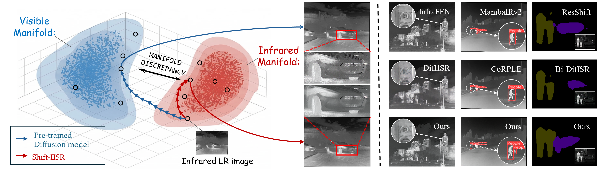

<div align="center">

<h2>Decoupling Cross-Modality Manifold Discrepancy for Infrared Super-Resolution</h2>

<b>Accepted by ACM Multimedia 2026</b>

<br>

<!-- Replace the mailto and Scholar-link placeholders with each author's links. -->
<a href="mailto:huayunpeng2011@126.com"><u>Yunpeng Hua</u></a><sup>&#42;</sup></a>,
<a href="mailto:yuhongwei22@xs.ustb.edu.cn"><u>Hongwei Yu</u></a><sup>&#42;</sup></a>,
<a href="mailto:ljw19970218@163.com"><u>Jiawei Li</u></a>&nbsp;<a href="https://scholar.google.com/citations?user=xWy8RZEAAAAJ&hl=en&oi=ao" title="Google Scholar"></a>,
<a href="mailto:liuqk3@ustb.edu.cn"><u>Qiankun Liu</u></a>&nbsp;<a href="https://scholar.google.com/citations?user=TNDbzzMAAAAJ&hl=en&oi=ao" title="Google Scholar"></a>,
<a href="mailto:mhmpub@ustb.edu.cn"><u>Huimin Ma</u></a>&nbsp;<a href="https://scholar.google.com/citations?user=32hwVLEAAAAJ&hl=en&oi=ao" title="Google Scholar"></a>, and
<a href="mailto:jschen@ustb.edu.cn"><u>Jiansheng Chen</u></a><sup>†</sup>&nbsp;<a href="https://scholar.google.com/citations?user=A1gA9XIAAAAJ&hl=en&oi=ao" title="Google Scholar"></a>

School of Computer & Communication Engineering, USTB, China

<sup>&#42;</sup> Equal contribution. &nbsp;&nbsp;<sup>†</sup> Corresponding author.

<br>

[](#)
[](https://www.python.org/)
[](https://pytorch.org/)
[](LICENSE)


<!-- Replace the # placeholders after the paper and PDF links are public. -->
[[Paper](https://arxiv.org/abs/2607.21174)] [[PDF](https://arxiv.org/pdf/2607.21174)] [[Code](https://github.com/Assassink8/Shift-IISR)]

</div>

## Updates
- 2026.07.20: Initial code release for Shift-IISR.

## Overview

Infrared image super-resolution (IISR) seeks to recover high-resolution infrared images from low-resolution inputs. Beyond improving image clarity, effective IISR must preserve both global infrared distributional characteristics and local structural details. Existing approaches often provide insufficient or overly intrusive guidance for these two aspects, and the issue is particularly pronounced when adapting diffusion models pre-trained on visible images: their visible-spectrum priors can bias the reconstruction away from the infrared manifold.

<p align="center">
  
</p>

## Framework

<p align="center">
  
</p>

Shift-IISR is a dual-path diffusion framework for 4× infrared image super-resolution that adapts a visible-image diffusion prior to the infrared domain while retaining its generative capability through two complementary modules:

- **Global Representation Modulation (GRM)** progressively injects infrared
  features into the denoising network to reduce visible-prior bias and improve
  global distributional consistency.
- **Local Structure Refinement (LSR)** incorporates edge-based structural cues
  at each denoising step to suppress artifacts and preserve geometric fidelity.


## Environment

Tested with Python 3.10, PyTorch 2.1.1, CUDA 12.1, and xformers 0.0.23.

```bash
conda create -n shift_iisr python=3.10
conda activate shift_iisr

pip install torch==2.1.1 torchvision==0.16.1 \
  --index-url https://download.pytorch.org/whl/cu121
pip install -r requirements.txt
```

## Inference

>Note: The inference script automatically downloads the frozen ResShift UNet and autoencoder to `weights/` when they are unavailable. If automatic downloading fails, please follow [Prepare Models](#prepare-models) to download them manually.

### Quick Test

The repository includes 10 paired LR/HR examples in `testdata/LR` and `testdata/HR`. The following commands enable rapid inference and quantitative evaluation:

```bash
CUDA_VISIBLE_DEVICES=0 python inference_shift_iisr.py \
  -i testdata/LR \
  -o ./results/quick_test \
  --chop_size 512 \
  --bs 1

CUDA_VISIBLE_DEVICES=0 python evaluate.py \
  --input ./results/quick_test \
  --reference testdata/HR \
  --result_suffix x4 \
  --device cuda:0
```

### Custom Input

Run 4× super-resolution on a single image or a folder of images:

```bash
CUDA_VISIBLE_DEVICES=0 python inference_shift_iisr.py \
  -i /path/to/input \
  -o ./results \
  --shift_iisr_path weights/shift_iisr.pth \
  --chop_size 512 \
  --bs 1
```

### Evaluation

Evaluation requires paired ground-truth images with matching filenames:

```bash
CUDA_VISIBLE_DEVICES=0 python evaluate.py \
  --input ./results \
  --reference /path/to/ground_truth \
  --device cuda:0
```
When result names include an additional suffix, provide it with `--result_suffix`, for example `--result_suffix _x4`.

## Training

### Prepare Models

Training initializes from the frozen ResShift UNet and autoencoder. Download the following base checkpoints to `weights/`:

```bash
wget -O weights/autoencoder_vq_f4.pth https://github.com/zsyOAOA/ResShift/releases/download/v2.0/autoencoder_vq_f4.pth
wget -O weights/resshift_bicsrx4_s4.pth https://github.com/zsyOAOA/ResShift/releases/download/v2.0/resshift_bicsrx4_s4.pth
```

### Prepare Data

Prepare infrared and visible training images in separate folders. The two folders must contain paired images with identical filenames.

```text
train_data/
      ├── ir/
      │   ├── 000001.png
      │   ├── 000002.png
      │   └── ...
      └── vis/
          ├── 000001.png
          ├── 000002.png
          └── ...
```

### Launch Training

Set the infrared and visible training-image folders, then launch single-GPU training:

```bash
CUDA_VISIBLE_DEVICES=0 python main.py \
  --cfg_path configs/shift_iisr_x4_train.yaml \
  --save_dir ./checkpoints/shift_iisr \
  data.train.params.ir_source_path=/path/to/train/ir \
  data.train.params.vis_source_path=/path/to/train/vis
```

Training saves an inference checkpoint as `shift_iisr_<iteration>.pth` and a resumable state as `training_state_<iteration>.pth` under `ckpts/`. Resume with the training-state checkpoint:

```bash
CUDA_VISIBLE_DEVICES=0 python main.py \
  --cfg_path configs/shift_iisr_x4_train.yaml \
  --resume /path/to/ckpts/training_state_<iteration>.pth
```


## Experimental Results

### Manifold Discrepancy

<p align="center">
  
</p>
t-SNE and UMAP projections show that Shift-IISR features most closely overlap with the infrared ground-truth distribution. In contrast, ResShift exhibits a larger visible-prior-induced shift, while DifIISR provides partial alignment but retains a noticeable distribution gap, particularly under dataset transfer.

### Qualitative Results
<p align="center">
  
</p>

### Quantitative Results

<p align="center">
  
</p>


## Citation

```bibtex
@inproceedings{hua2026shift_iisr,
  title     = {Decoupling Cross-Modality Manifold Discrepancy: Leveraging Visible Diffusion Priors for Infrared Super-Resolution},
  author    = {Hua, Yunpeng and Yu, Hongwei and Li, Jiawei and Liu, Qiankun and Ma, Huimin and Chen, Jiansheng},
  booktitle = {Proceedings of the ACM International Conference on Multimedia},
  year      = {2026},
}
```

## License

This repository is released under the [NTU S-Lab License 1.0](LICENSE) for non-commercial research purposes. For commercial use, please contact the original contributors.

## Acknowledgement

This project builds upon [ResShift](https://github.com/zsyOAOA/ResShift). We thank the authors for making their implementation available.

## Contact

If you have any questions, please contact `huayunpeng2011@126.com`.
