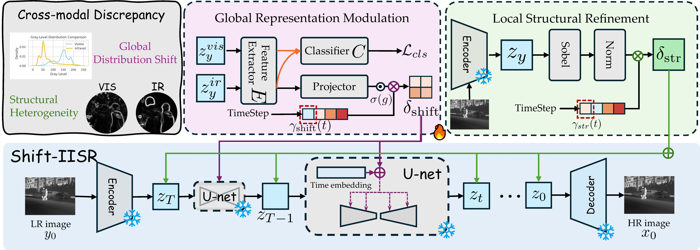
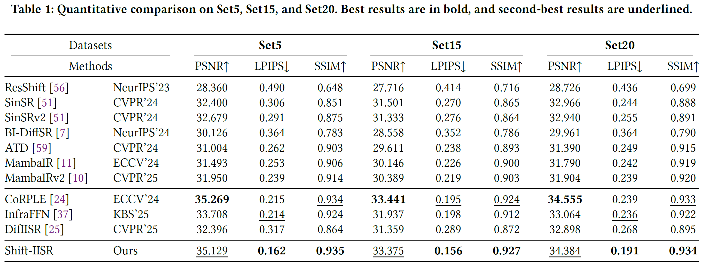
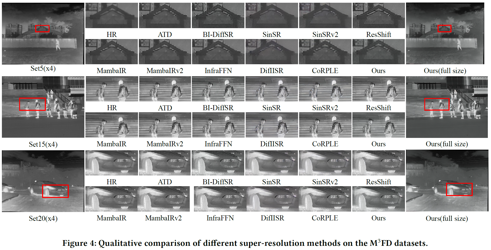
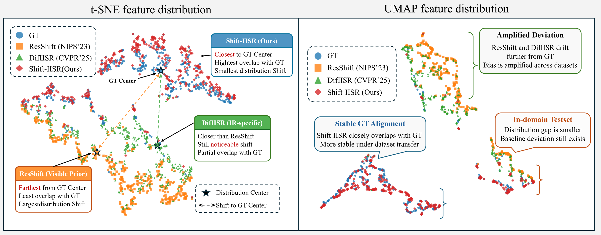

# Shift-IISR: Decoupling Cross-Modality Manifold Discrepancy for Infrared Super-Resolution

> ACM Multimedia 2026

Yunpeng Hua, Hongwei Yu, Jiawei Li, Qiankun Liu, Huimin Ma, and Jiansheng Chen

<!-- LINK PLACEHOLDER: Add the paper and author/project links here after publication. -->

Shift-IISR is a diffusion-based framework for 4× infrared image super-resolution. It adapts a visible-image diffusion prior to the infrared domain through Global Representation Modulation (GRM), while Local Structure Refinement (LSR) strengthens structural fidelity during diffusion.

<p align="center">
  
</p>

## Highlights

- A lightweight adaptation of the visible diffusion prior; the ResShift UNet and autoencoder remain frozen.
- GRM aligns global modality representation using an infrared feature extractor and a projector.
- LSR enhances local structural consistency through timestep-aware modulation.
- Supports single-GPU training and inference.

## Pretrained Weights

The released Shift-IISR checkpoint is included in this repository:

```text
weights/shift_iisr.pth
```

This checkpoint contains the released GRM feature extractor and GRM projector. It does not duplicate the frozen ResShift UNet or autoencoder.

The required frozen ResShift base weights are downloaded automatically to `weights/` when absent. They can also be downloaded manually:

- [Autoencoder (`autoencoder_vq_f4.pth`)](https://github.com/zsyOAOA/ResShift/releases/download/v2.0/autoencoder_vq_f4.pth)
- [ResShift UNet (`resshift_bicsrx4_s4.pth`)](https://github.com/zsyOAOA/ResShift/releases/download/v2.0/resshift_bicsrx4_s4.pth)

## Deployment

### Environment

Tested with Python 3.10, PyTorch 2.1.1, CUDA 12.1, and xformers 0.0.23.

```bash
conda create -n shift_iisr python=3.10
conda activate shift_iisr

pip install torch==2.1.1 torchvision==0.16.1 \
  --index-url https://download.pytorch.org/whl/cu121
pip install -r requirements.txt
```

PyTorch is installed separately first to explicitly select its CUDA 12.1 build. The pinned `torch` and `torchvision` entries in `requirements.txt` then confirm the same installed versions and are not downloaded again. A CUDA-capable PyTorch build requires a compatible NVIDIA driver; a separately installed CUDA toolkit is not required.

### Quick Test

The repository provides 10 paired LR/HR examples in `testdata/LR` and `testdata/HR`. The following commands run inference and then evaluate PSNR, SSIM, and LPIPS:

```bash
CUDA_VISIBLE_DEVICES=0 python inference_shift_iisr.py \
  -i testdata/LR \
  -o ./results/quick_test \
  --chop_size 512 \
  --bs 1

CUDA_VISIBLE_DEVICES=0 python evaluate.py \
  --input ./results/quick_test \
  --reference testdata/HR \
  --result_suffix x4 \
  --device cuda:0
```

The first inference run downloads the two frozen ResShift base weights automatically if they are not already in `weights/`.

### Inference and Evaluation

Run 4× super-resolution on one image or a folder of images:

```bash
CUDA_VISIBLE_DEVICES=0 python inference_shift_iisr.py \
  -i /path/to/input \
  -o ./results \
  --shift_iisr_path weights/shift_iisr.pth \
  --chop_size 512 \
  --bs 1
```

The output images are saved in RGB format. Use a smaller `--chop_size` (256 or 64) if GPU memory is limited.

#### Evaluation

The evaluation script requires paired ground-truth images with matching filenames and reports the paper metrics: PSNR and SSIM on the Y channel, and LPIPS on RGB images.

```bash
CUDA_VISIBLE_DEVICES=0 python evaluate.py \
  --input ./results \
  --reference /path/to/ground_truth \
  --device cuda:0
```

If result filenames have an added suffix, provide it with `--result_suffix`:

```bash
python evaluate.py \
  --input ./results \
  --reference /path/to/ground_truth \
  --result_suffix _x4 \
  --device cuda:0
```

### Training

Set the infrared and visible training-image folders, then launch single-GPU training:

```bash
MPLCONFIGDIR=/tmp/matplotlib CUDA_VISIBLE_DEVICES=0 python main.py \
  --cfg_path configs/shift_iisr_x4_train.yaml \
  --save_dir ./checkpoints/shift_iisr \
  data.train.params.ir_source_path=/path/to/train/ir \
  data.train.params.vis_source_path=/path/to/train/vis
```

The training configuration is in `configs/shift_iisr_x4_train.yaml`. It saves an inference checkpoint as `shift_iisr_<iteration>.pth` and a resumable training state as `training_state_<iteration>.pth` under the run's `ckpts/` directory.

To resume training, use the training-state checkpoint rather than the inference checkpoint:

```bash
CUDA_VISIBLE_DEVICES=0 python main.py \
  --cfg_path configs/shift_iisr_x4_train.yaml \
  --resume /path/to/ckpts/training_state_<iteration>.pth
```

## Results

### Quantitative Comparison

<p align="center">
  
</p>

### Qualitative Comparison

<p align="center">
  
</p>

### Manifold Discrepancy

<p align="center">
  
</p>

## Citation

```bibtex
@inproceedings{hua2026shift_iisr,
  title     = {Decoupling Cross-Modality Manifold Discrepancy: Leveraging Visible Diffusion Priors for Infrared Super-Resolution},
  author    = {Hua, Yunpeng and Yu, Hongwei and Li, Jiawei and Liu, Qiankun and Ma, Huimin and Chen, Jiansheng},
  booktitle = {Proceedings of the ACM International Conference on Multimedia},
  year      = {2026}
}
```

## Acknowledgements

This project builds on [ResShift](https://github.com/zsyOAOA/ResShift). We thank the authors for making their implementation available.

## Contact

For questions, contact `huayunpeng2011@126.com`.
